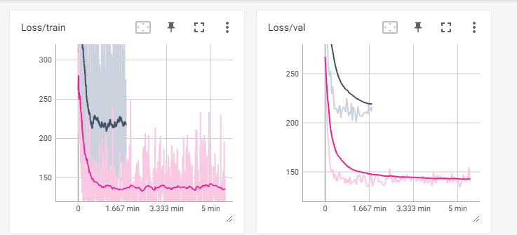
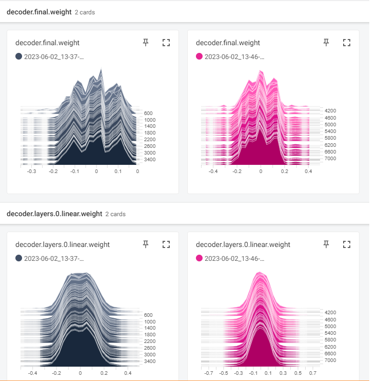
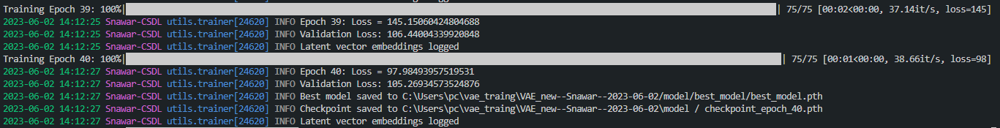
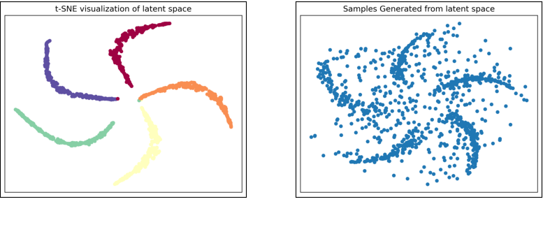

# Codebase for streamlined and Structured Deep Learning Training

I wanted to share some of my code that i wrote recently which serves as a well structured project skeletal for training and evaluating deep learning models. I've put a lot of effort into making it as user-friendly and efficient as possible, with the aim to serve as a solid starting point for anyone kicking off a new deep learning project.

Here's why I think you might find it helpful:

### Organized Project Structure:

It automatically creates a neat project directory based on parameters like date, project name, and your name - no more messing around with file organization!
change the experimentor and project name in the `main.py` before running it to initialize a new project.

```python
#initialize Project
working_dir = 'my-awesome-project'
pm = ProjectManager(p_name='VAE', working_dir=working_dir, experimenter='Bilbo Baggins')
```

it will automatically make a new project with neccessasry sub-directories.

```

VAE--XYZ--2023-06-01/
├── config.yaml
├── model/
│   ├── best_model/
│   │   └── best_model.pth
│   ├── checkpoint_epoch_10.pth
│   ├── checkpoint_epoch_20.pth
│   ├── checkpoint_epoch_40.pth
│   └── checkpoint_epoch_50.pth
├── plots/
│   ├── latent_space.png
│   └── samples.png
├── results/
│   ├── latent_space_embeddings.npy
│   └── latent_space_labels.npy
└── tensorboard/
    └── events.out.tfevents.1685621875.XYZ-ABS.27936.0
```

### Easily Configurable:

A `config.yaml` file is automatically set up when you start a new project, making it easy to adjust model and training parameters. You can easily extent the `config.yaml` by changing the template function `create_config_template` in `aux_func.py`

```yaml
# Project configurations
Project:
  project_name: VAE--XYZ--2023-06-01
  experimenter_name: XYZ
  project_directory: vae_traing\VAE--XYZ--2023-06-01
  config: config.yaml


# Model configurations
Model:
  epochs: 50
  learning_rate: 0.005
  batch_size: 16
  input_dim: 2
  hidden_size: 256
  num_layers: 2
  latent_dim: 32
  decoder_type: MLP
  encoder_type: MLP
  optimizer: Adam
  save_every: 10

```

### Clean, Transparent Code

The code is straightforward, without any hidden complexities. Whether you're a seasoned programmer or new to the game, it's designed to be easily understood.

### TensorBoard Integration:

Monitor your model's training in real-time with seamless TensorBoard integration.
visualize `embeddings` , `losses`, `weights` `learning_rate` and many `histograms`
<!-- add inage -->




### Detailed Logging

All key details from the training process are logged, providing a thorough record of learning rates, loss values, and latent vector embeddings at each iteration across multiple runs.



### Resume Training Capability

No worries if your training gets interrupted - the framework can pick up right where it left off.

### Model Saving

The framework periodically saves your model's state during training and keeps a separate copy of the best model (the one with the lowest validation loss).

### Easy Evaluation & Visualization

With the evaluation.py script, you can easily load the best model, run predictions, calculate loss/error, and visualize reconstructions.

While the code is initially set up for a Variational AutoEncoder (VAE), it can be easily adapted to other models or network architectures with only a few tweaks.

I've found it to be a great tool in my own projects, and I'm excited to share it with the community. If you find it useful, please consider giving it a star on GitHub. As always, I'm open to feedback and suggestions to make it even better. Check it out and let me know what you think!